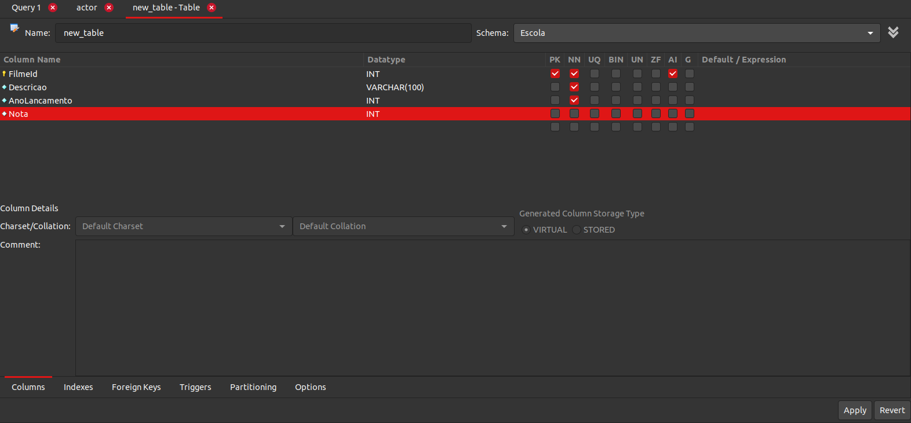

# Exercício 01

Resposta:

Clicando no canto superior em "Tables", clicando com o botão direito do mouse na tabela selecionada e clicar em "Select Rows"

# Exercício 02

Resposta:

Seleciona o Schema desejado, clique com o botão direito do mouse sobre "Tables" e em seguida em "Create Table".

# Exercício 03

Resposta: 

# Exercício 04

Resposta:

Faz referência a tabela `country`.

# Exercício 05

Resposta:

N:1

# Exercício 06

Resposta:

1:N

# Exercício 07

1. store -> staff
2. language -> film
3. film -> language

